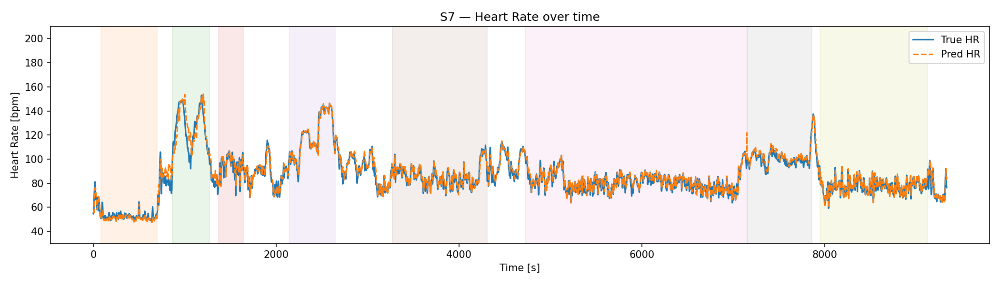
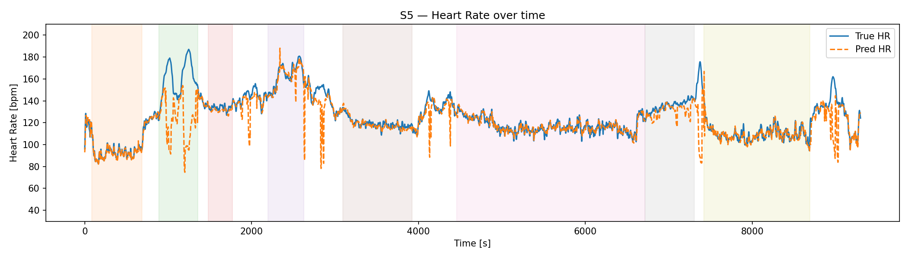

# PPG-Dalia Heart Rate Estimation

Research implementation for heart-rate estimation from wrist photoplethysmography (PPG) and accelerometer (ACC) signals using the PPG-Dalia dataset under strict leave-one-subject-out validation.

This repository provides a cleaned public implementation intended for academic, research, and reproducibility purposes. The dataset, private checkpoints, unpublished internal experiment settings, and manuscript-specific materials are not included.

---

## Overview

Wearable PPG-based heart-rate estimation is challenging because wrist signals are strongly affected by motion artifacts, especially during dynamic activities such as walking, cycling, stairs, and table soccer.

This project implements a deep learning pipeline that processes synchronized PPG and ACC windows, extracts temporal signal representations, estimates heart rate, and evaluates subject-level generalization using strict leave-one-subject-out validation.

The public pipeline includes:

- PPG-Dalia subject-level data loading
- Fixed-length PPG and ACC window extraction
- ACC resampling and signal alignment
- PPG and ACC normalization
- Artifact-aware preprocessing
- Temporal neural network modeling
- Uncertainty-aware prediction
- Post-processing and quality gating
- Subject-wise and activity-wise evaluation
- TorchScript model export support

---

## Repository Structure

```text
ppg-dalia-heart-rate-estimation/
├── configs/
│   └── ppg_dalia_loso.yaml
├── scripts/
│   ├── run_loso.py
│   ├── export_model.py
│   └── summarize_results.py
├── src/
│   ├── config.py
│   ├── signal_utils.py
│   ├── data.py
│   ├── network.py
│   ├── objectives.py
│   ├── inference.py
│   ├── evaluation.py
│   ├── visualization.py
│   └── trainer.py
├── LICENSE
├── NOTICE
├── requirements.txt
└── README.md
```

---

## Method Pipeline

The system follows a subject-level evaluation pipeline for estimating heart rate from wrist PPG and accelerometer signals.


```text
PPG-Dalia subject files
        ↓
Load wrist BVP, wrist ACC, HR labels, and activity labels
        ↓
Extract synchronized 8-second PPG and ACC windows
        ↓
Resample ACC and normalize wearable signals
        ↓
Apply artifact-aware preprocessing
        ↓
Build temporal sequences of consecutive windows
        ↓
Train heart-rate estimation model
        ↓
Apply inference-time smoothing and quality gating
        ↓
Evaluate using strict leave-one-subject-out validation
```

---

## Dataset

This repository uses the PPG-Dalia dataset.

The dataset is not included in this repository. Users must obtain it from the original data provider and follow the original license, access conditions, and citation requirements.

Expected dataset structure:

```text
PPG_FieldStudy/
├── S1/
│   └── S1.pkl
├── S2/
│   └── S2.pkl
├── ...
└── S15/
    └── S15.pkl
```

---

## Installation

Clone the repository:

```bash
git clone https://github.com/just9tan/ppg-dalia-heart-rate-estimation.git
cd ppg-dalia-heart-rate-estimation
```

Create and activate a virtual environment on Windows:

```bash
python -m venv .venv
.venv\Scripts\activate
```

Install dependencies:

```bash
pip install -r requirements.txt
```

For Linux or macOS:

```bash
python -m venv .venv
source .venv/bin/activate
pip install -r requirements.txt
```

For GPU training, install a PyTorch version that matches your CUDA version.

---

## Running Strict LOSO Evaluation

Run strict leave-one-subject-out evaluation:

```bash
python scripts/run_loso.py --data_dir "D:/path/to/PPG_FieldStudy"
```

Quick smoke test:

```bash
python scripts/run_loso.py --data_dir "D:/path/to/PPG_FieldStudy" --epochs 1 --no_plots
```

Optional arguments on Windows PowerShell:

```powershell
python scripts/run_loso.py `
  --data_dir "D:/path/to/PPG_FieldStudy" `
  --epochs 60 `
  --batch 128 `
  --lr 3e-4 `
  --val_k 3
```

Optional arguments on Linux or macOS:

```bash
python scripts/run_loso.py \
  --data_dir "D:/path/to/PPG_FieldStudy" \
  --epochs 60 \
  --batch 128 \
  --lr 3e-4 \
  --val_k 3
```

---

## Exporting the Model

Train a final model and export it as a TorchScript checkpoint:

```powershell
python scripts/export_model.py `
  --data_dir "D:/path/to/PPG_FieldStudy" `
  --export_path "checkpoints/ppg_dalia_hr_estimator.pt"
```

For Linux or macOS:

```bash
python scripts/export_model.py \
  --data_dir "D:/path/to/PPG_FieldStudy" \
  --export_path "checkpoints/ppg_dalia_hr_estimator.pt"
```

The exported model is intended for research inference and deployment experiments.

---

## Results

The training script exports subject-wise and activity-wise results as CSV files:

```text
strict_loso_results.csv
strict_loso_results_by_activity.csv
```

You can summarize subject-wise results with:

```bash
python scripts/summarize_results.py --csv strict_loso_results.csv
```

### Qualitative Prediction Examples

The following examples compare the reference heart rate and the predicted heart rate over time. The blue curve represents the reference heart rate, while the orange dashed curve represents the model prediction. The shaded background regions indicate different activity segments.

#### Representative subject example

Subject S7 is used as a representative qualitative example. The predicted heart-rate curve follows the overall reference trend across both resting and dynamic activity periods, including several rapid increases and recovery phases.



#### Challenging subject example

Subject S5 is shown as a more challenging example. This case contains larger heart-rate peaks and stronger motion-related variability. The prediction follows the overall temporal trend, but larger deviations appear during high-intensity or rapidly changing segments, reflecting the remaining difficulty of wrist-based PPG heart-rate estimation under motion artifacts.



Full tuned experimental settings and manuscript-specific quantitative results may be released after publication, subject to publication and co-author policy.

---

## Notes on Reproducibility

This repository provides a cleaned public implementation. It does not redistribute:

- PPG-Dalia dataset files
- private experimental notebooks
- private checkpoints
- unpublished internal tuning logs
- manuscript figures or publication text unless explicitly stated

Random seeds, PyTorch version, GPU type, preprocessing settings, and dataset access may affect reproduced results.

---

## License

The source code in this repository is released under the Apache License 2.0.

The PPG-Dalia dataset is not redistributed and remains subject to its original license and access conditions. The manuscript, publication text, paper figures, and third-party materials are not covered by this software license unless explicitly stated.

---

## Citation

If you use this repository, please cite the associated paper once available and the original PPG-Dalia dataset.

Citation metadata will be updated after publication.
